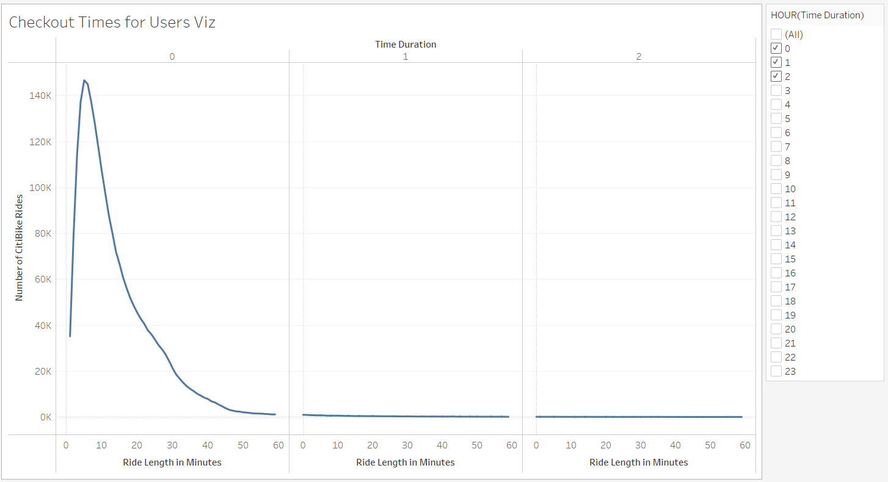
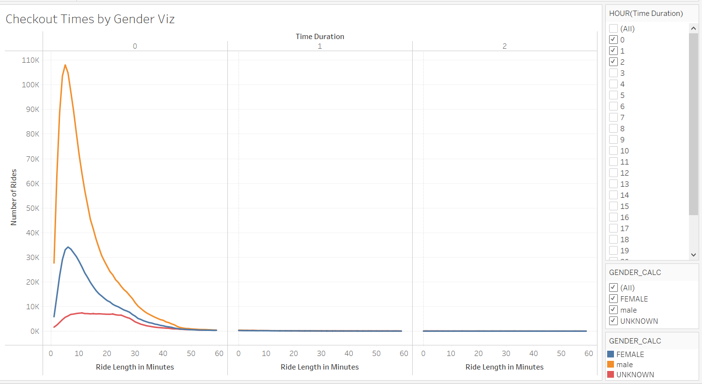
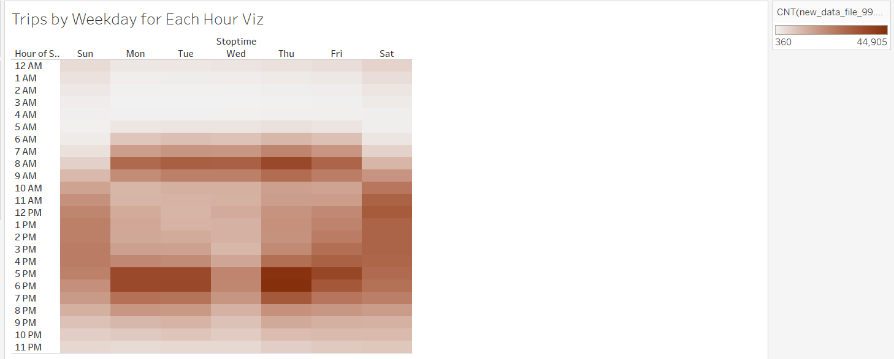
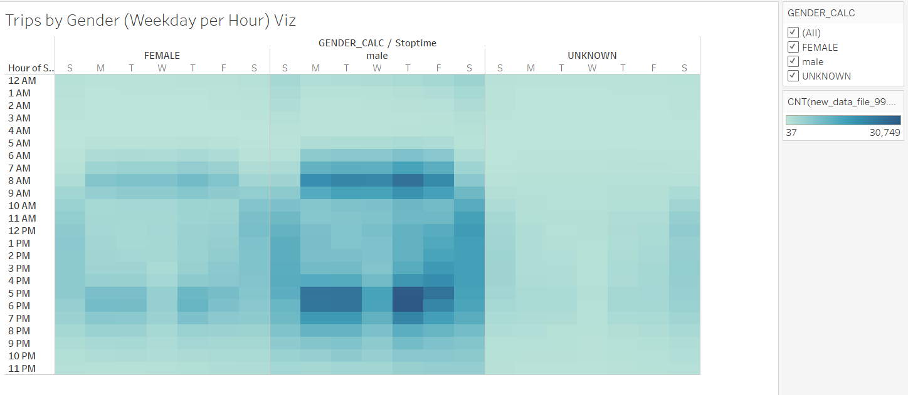
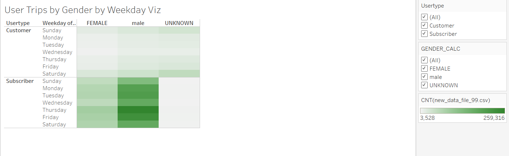
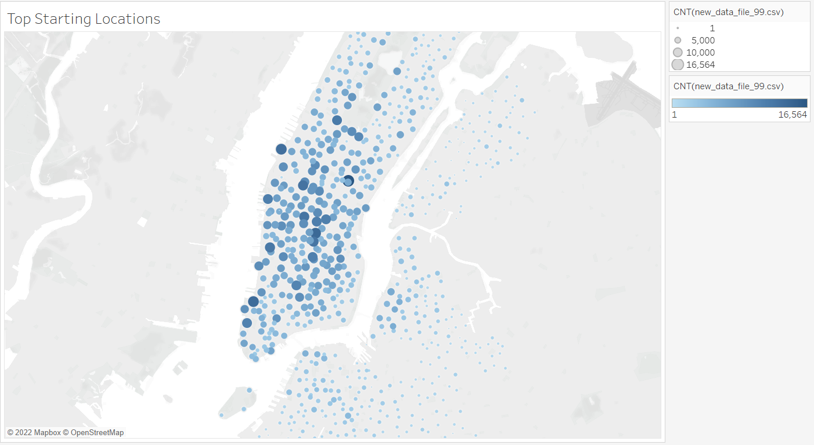
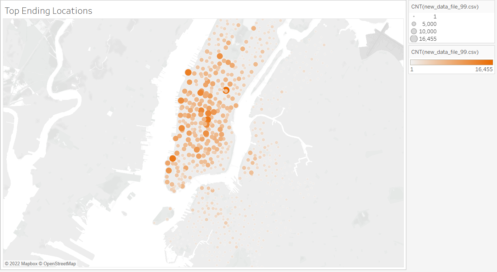

# Bike_Sharing
[Link to Tableau](https://public.tableau.com/app/profile/timothy.keating)

## Overview of the analysis
The purpose of this analysis is to convince investors that a bike-sharing program in Des Moines is a solid business proposal. 

## Results

### Checkout Times for Users Viz
A large majority of the Ride Durations are 10 minutes or less:

### Checkout Times by Gender Viz
More rides are taken by males than females:

### Trips by Weekday for Each Hour Viz
On Monday-thru-Fridays, the times of most rides are in the "work rush hour" zones - 8am before work; 5-6pm after work:

### Trips by Gender (Weekday per Hour) Viz
Male riders are most likely to be commuting to work, as the times of most rides are in the "work rush hour" zones - 8am before work; 5-6pm after work:

### User Trips by Gender by Weekday Viz
It seems that Riders only put in "UNKNOWN" as their gender if they are Customers, and not Subscribers:

### Top Starting Locations Viz
Manhattan Island is the primary area for rides to start:

### Top Ending Locations Viz
Manhattan Island is the primary area for rides to end:

## Summary
At a high level, we can come to many conclusions.  The riders on the Bike Sharing app are primarily male; they use the bikes to commute to and from work; most of these people live and work in Manhattan.
